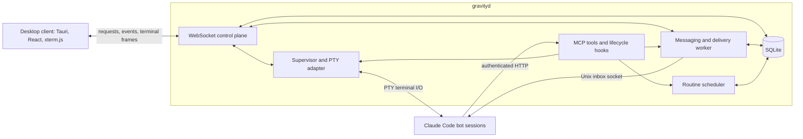

# Gravity architecture

Gravity runs persistent, named Claude Code bots grouped into projects. A Rust
daemon owns the bot processes, durable messages, routines, and project state.
The desktop app connects to that daemon to render terminals and manage the
system. Closing a client leaves the daemon and its bots running.

This document describes the current implementation. See the
[control-plane protocol](protocol.md) for request and event schemas, the
[README](../README.md) for development and installation commands, and
[public-build configuration](public-builds.md) for optional services.

## Components and topology

The supported desktop distribution targets macOS on Apple Silicon. The daemon
can run on the same Mac as the client or on a separate host reachable over a
private network. It binds to loopback on port `49777` by default.



| Component | Responsibility | Source |
| --- | --- | --- |
| Shared bus crate | Entity types, SQLite migrations, message envelopes | [crates/bus/src/lib.rs:1](../crates/bus/src/lib.rs#L1) |
| Daemon assembly | Shared state, HTTP routes, background workers | [crates/gravityd/src/server.rs:1](../crates/gravityd/src/server.rs#L1) |
| Supervisor | Session lifecycle, crash recovery, terminal state | [crates/gravityd/src/supervisor.rs:1](../crates/gravityd/src/supervisor.rs#L1) |
| Runtime adapters | Start, probe, input, resize, and terminate sessions | [crates/gravityd/src/runtime/mod.rs:1](../crates/gravityd/src/runtime/mod.rs#L1) |
| Delivery worker | Lease queued messages, deliver, retry, report failures | [crates/gravityd/src/delivery.rs:1](../crates/gravityd/src/delivery.rs#L1) |
| Scheduler | Scheduled occurrences, signals, run completion, retries | [crates/gravityd/src/scheduler.rs:1](../crates/gravityd/src/scheduler.rs#L1) |
| Desktop frontend | Project and bot views, terminal rendering, connection state | [apps/desktop/src/App.tsx:1](../apps/desktop/src/App.tsx#L1) |
| Native shell | Local daemon installation, native window controls, updates | [apps/desktop/src-tauri/src/lib.rs:1](../apps/desktop/src-tauri/src/lib.rs#L1) |

The daemon uses Tokio and Axum. SQLite access uses `rusqlite`, with a shared
connection protected by a mutex, WAL journaling, foreign keys, and versioned
migrations. The frontend uses TypeScript and React; xterm.js renders Claude
Code's terminal interface inside the Tauri window.

## State ownership

SQLite holds projects, bot identities and instructions, conversations, messages,
deliveries, tasks, routines, run history, signals, device grants, identity
revisions, and the decision registry. FTS5 indexes support searching stored
message bodies and decision records.

Filesystem manifests describe provisioned projects and bots. The daemon
generates `system.md` from the bot's identity, instructions, and bus guidance.
The bot maintains its own living context in `workspace/CLAUDE.md`. Project and
bot directory names stay stable across display-name changes.

Live process handles, terminal replay buffers, and event subscriptions belong
to the running daemon. Client preferences, selection, and rendering state
belong to the desktop app. Claude Code owns its session transcripts and
authentication. The daemon reads transcripts to derive activity previews and
correlate completed routine turns; a terminal conversation does not
automatically become a bus conversation.

## Bot lifecycle and runtime

The production `pty` adapter launches `claude` through `portable-pty`, using
the bot's workspace as its working directory. The supervisor supplies the
generated system prompt, MCP configuration, hooks, and scoped token through
arguments and environment variables. Sessions use Claude Code's continuation
support when restarted.

The supervisor starts live bots at daemon startup, starts newly created bots,
and reconciles missing sessions periodically. Crashed sessions restart with
backoff. Archiving a bot stops its process, revokes its token, cancels open
tasks, and retains its workspace until the configured retention period expires.
The per-project population limit bounds how many live bot records can exist.

Process events and authenticated lifecycle hooks update observable states such
as `starting`, `ready`, `working`, `waiting_for_approval`, and `crashed`. A
completed turn can return a bot to `ready` while the process stays alive.
Permission decisions are handled through Claude Code's native terminal prompts;
the PTY adapter does not advertise an out-of-band permission relay.

The `double` adapter supplies deterministic sessions for tests and local
development without Claude authentication or model calls. These two adapters
implement the same runtime contract. Native background-session supervision and
an Agent SDK adapter are not implemented runtime choices.

## Messaging and delivery

Messages travel through the durable bus. A user can send a message through the
control plane; a bot uses MCP tools such as `send_message`, `check_inbox`, and
`complete_task`. Bot-to-bot addressing is scoped to a project.

The delivery path is:

1. Persist the message and enqueue a delivery for the recipient.
2. Lease a due delivery so a worker owns the current attempt.
3. Render the message envelope, including task or routine-run correlation.
4. Write it to the recipient session's Unix inbox socket.
5. Record delivery success or schedule a retry, and publish state changes.

The `SessionStart` hook reports the session's inbox socket to the supervisor.
This socket carries incoming bus messages while the PTY carries terminal input
and output. Messages can be received during a turn without being mixed into
partially typed terminal input.

Delivery states are `queued`, `leased`, `delivered`, `acknowledged`, and
`failed`. Socket delivery is at-least-once: a crash between sending and recording
success can cause a repeated delivery. Idempotency keys prevent duplicate
outbox enqueueing, and inbox acknowledgement records application-level
consumption. A successful socket write alone does not prove the bot completed
the requested work.

A bot that has not started or has not reported its socket causes delivery to
wait without spending a retry attempt. Transport failures use bounded retries
with backoff. Expired leases are recovered, and failed deliveries remain
available for inspection and manual retry.

Bot-to-bot delegation creates correlated task records. Completion sends a
result back to the requester. Task deadlines, cancellation, hop accounting,
origin chains, and reply budgets bound delegation and expose unfinished work.
Shared project artifacts hold files; bus messages can carry summaries and paths.

## Decisions

Some questions only the owner can settle, and a bot that asks in its terminal
asks somewhere the daemon cannot see. The decision registry gives that traffic
a durable home: a bot raises a record with its context, options and a
recommendation, and goes on with other work. The owner answers from one inbox
across every project, and publishing turns the ruling into a bus delivery whose
sender is the user rather than a peer — which is what makes it authority a
working bot can act on.

Settled rulings replace the hand-written ledgers each lead bot used to keep.
They are never retained away, and retention spares the messages and tasks a
decision cites, so the reason behind a ruling stays readable. A project may
name a lead bot, which is told about every decision raised there; it cannot
answer for the owner. See the [protocol](protocol.md#the-decision-registry).

## Routines and signals

A routine belongs to one bot and combines a prompt with a cron, interval, or
named-signal trigger. Cron triggers include a timezone. Bots can create and
manage their own routines through MCP; created routines are enabled immediately.

The scheduler persists each occurrence as a `routine_run`. Unique occurrence
keys prevent duplicate scheduling, and transactional dispatch connects a run
to its message and delivery. Each run records its source, attempts, deadline,
completion state, and any failure. Overlap policies are `skip`, `queue_one`,
`queue_all`, and `replace`.

Time-based scheduling runs every 30 seconds by default, with bounded catch-up
for missed occurrences. Run leases also enforce deadlines; failed runs can
retry according to their configured attempt limit and backoff. Completion is
matched to the routine-run marker in the session transcript so an unrelated
user turn cannot complete a pending run.

Signals are project-scoped records emitted by bots or users. A routine matches
a signal name and optionally a sending bot. Origin chains, hop limits, and
per-routine signal deduplication constrain cycles and repeated scheduling.
File watchers and external webhook integrations are not built-in signal
producers in the current implementation.

## Control plane and desktop client

The daemon serves four routes:

| Route | Purpose | Authentication |
| --- | --- | --- |
| `GET /health` | Basic daemon and database health | No token |
| `GET /ws` | Versioned client control plane | Owner or device token in the handshake |
| `POST /mcp` | Bot tools | Per-bot bearer token |
| `POST /hook` | Runtime lifecycle events and socket registration | Per-bot bearer token |

The WebSocket protocol uses request IDs, structured errors, and unsolicited
push events. The current protocol version is 2. Device grants distinguish
read access, control access, and `approve` — the grant that rules on a
decision, held separately because running the fleet is not the same authority
as answering for the owner. Browser connections also pass Origin validation.

Clients load snapshots after connecting and then apply entity, activity,
delivery, and routine-run pushes. Each terminal attachment receives sequenced
output and can resume from its last cursor while the daemon's bounded replay
buffer still contains the relevant data. The client resets its terminal when
the replay cannot resume its existing screen. Terminal scrollback is an
in-memory buffer, separate from persistent Claude Code transcripts.

Multiple clients may attach to a bot. Any client with the `control` grant may
type or resize its terminal; the protocol has no exclusive input lease.

The native shell installs the bundled daemon as a macOS launchd user agent,
discovers a local managed daemon, and offers app and daemon updates when the
distribution is configured for them. It also provides native operations such
as dock badges, global shortcuts, and opening project directories.

## Filesystem layout

The daemon state root defaults to `~/.gravity` and can be changed with
`GRAVITY_HOME` or configuration. A typical installation contains:

```text
~/.gravity/
  gravityd.toml
  bus.sqlite
  bin/gravityd
  secrets/
    client.token
    bot-<id>.token
    device-<id>.token
  logs/
  backups/
  projects/<project-directory>/
    project.json
    artifacts/
    bots/<bot-directory>/
      bot.json
      system.md
      mcp.json
      workspace/
        CLAUDE.md
        .claude/settings.json
```

Generated MCP configuration references the bot token through an environment
variable. Credentials are kept separately in restricted-permission files.
Workspace settings supply cooperative permissions and runtime hooks.

Development can use a separate daemon home and port through the repository's
development script, allowing multiple checkouts to run independently.

## Trust boundaries and recovery

Gravity is a single-user system. Bots share the host OS user and its available
credentials. Separate workspaces, scoped bus identities, and Claude Code
permission rules provide cooperative boundaries rather than OS-level isolation.
Bots may edit their own identity and manage bots they created, subject to
ownership checks and the project population limit. Identity changes have a
revision history that supports inspection and reverting changes.

Keep the control plane on loopback or a trusted private network. Remote clients
use separately issued device credentials; revocation removes the credential
and prevents subsequent authentication. A bot token grants access to bot tools
and hooks, not owner-level WebSocket control.

SQLite and delivery leases support recovery after daemon restarts. Online
backups include the database and selected configuration files; they exclude
the secret directory and bot workspaces. Back up workspace content separately.
Retention removes old messages, deliveries, routine runs, signals, and identity
revisions, and eventually reclaims archived bot workspaces.

Health and diagnostics expose runtime availability, database health, delivery
backlog, active bots, and version information. Optional frontend telemetry,
source-map uploads, and update hosting are described in
[public-build configuration](public-builds.md).

## Verification

Rust tests cover persistence, migrations, delivery, tasks, routines, device
credentials, supervision, and terminal replay. The runtime double exercises
daemon workflows without a model service. Frontend tests use an in-memory
daemon implementation and scripted WebSockets; visual regression tests render
component stories in a pinned Playwright container.

Changes to Claude Code arguments, lifecycle payloads, or inbox-socket behavior
also need verification against the real runtime. The test double cannot prove
compatibility with those external interfaces. Build, lint, typecheck, and test
commands are listed in the [README](../README.md#build--test).
