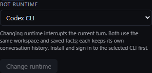

# Bot runtimes

Gravity can run Claude Code and Codex CLI bots in the same project. Install and
sign in to the selected CLI on the daemon's computer. In **Bot info → Bot runtime**,
choose the CLI and click **Change runtime**. This interrupts the active turn and
restarts the bot. Its workspace, instructions, saved facts, bus messages and routines
remain available. The two providers keep separate conversations; switching back
resumes that provider's saved conversation.



Existing bots and new bots use Claude Code by default. For a Codex-only installation,
set this in `~/.gravity/gravityd.toml` and restart the daemon:

```toml
default_bot_runtime = "codex_cli"
codex_bin = "codex"
codex_args = []
```

Use an absolute `codex_bin` or `claude_bin` path when the daemon service cannot find
the CLI on its PATH. Bot-authored children inherit their creator's runtime. Control
clients may also pass `runtime` when creating a bot. The `runtime = "double"` daemon
setting continues to select the deterministic test adapter for every bot.

## Codex terminal

Codex runs through [Codex App Server](https://learn.chatgpt.com/docs/app-server)
over stdio. Tested against Codex CLI 0.159.2. The terminal displays streamed text
and command output; type a prompt and press Enter. `/interrupt` or Ctrl+C cancels
the active turn. Bus messages arrive through structured turn requests and never
consume a partially typed terminal prompt. Terminal resize is cosmetic: this
adapter does not render the Codex full-screen CLI interface.

Approval requests appear with numbered prompts. `/approve 1` grants the requested
command, file change or permissions; `/deny 1` declines it. Permissions are granted
only for the current turn. Requests are never automatically approved. Questions use
`/answer 1 {"answers":{"question-id":{"answers":["your answer"]}}}`. MCP elicitation
uses `/answer 1 {"action":"accept","content":{"field":"value"}}`; `/deny 1` declines it.
Unsupported server requests fail explicitly.

Each bot receives its own Gravity bus token through an environment variable; the
App Server config enables the local Gravity MCP endpoint. Codex uses workspace-write
sandboxing with the project's shared artifacts directory included. It reads the
shared system instructions, `CLAUDE.md` and `FACTS.md`. Thread IDs and activity
observations are saved beside the workspace for restarts and routine correlation.
Interrupted or failed turns do not report successful routine completion.

## Upgrade

The additive SQLite migration sets existing bots to `claude_code`. Update the
daemon and client together to expose the picker; the client hides it for older
daemons. Keep a database backup before upgrading, as older daemons do not understand
Codex bots. CLI authentication and a live model response require the user's account;
the test suite uses a local App Server fixture without network or model charges.
