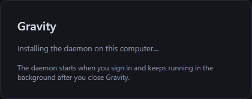

# Windows build

The Windows contribution (#15) builds a native x64 desktop installer and daemon.
Install the stable MSVC Rust toolchain, Visual Studio C++ build tools with the
Windows SDK, Node.js 22, pnpm 11, and Python 3.11 or newer. The desktop uses
WebView2; the installer downloads its bootstrapper when needed.

From PowerShell at the repository root:

```powershell
pnpm --dir apps/desktop install --frozen-lockfile
pnpm --dir apps/marketing install --frozen-lockfile
./scripts/prepare-sidecar.ps1
pnpm --dir apps/desktop tauri build --bundles nsis
```

The installer is written under
`apps/desktop/src-tauri/target/release/bundle/nsis/`. Tauri automatically merges
`tauri.windows.conf.json`, which selects a per-user NSIS installer and native
window decorations. The Windows CI workflow checks the daemon, frontend, native
shell, and installer and uploads the installer as a build artifact. The actual
installer lifecycle test checks fresh install, same-version refresh, uninstall,
and uninstall after manual daemon removal, using an isolated test home with no
real bots. It does not
publish a release or subscribe source builds to an update feed.

The Windows installer installs and starts the bundled daemon under
`%USERPROFILE%\.gravity\bin\gravityd.exe` and registers a Task Scheduler task
for the current user. No separate daemon download or command is needed. Running
the installer again refreshes the managed daemon even when the app version has
not changed, restarting bot sessions while preserving projects and configuration.
It runs immediately and at user sign-in, without elevation,
and leaves bots running when the desktop closes. The task requires an interactive
user session; it does not run while that user is signed out. Logs, configuration,
and state live under `%USERPROFILE%\.gravity`; `GRAVITY_HOME` overrides this root.
If Windows reserves the preferred port (for example for Hyper-V), the local
managed daemon chooses an available port and the desktop follows it. Direct
launches and remotely reachable daemons require an available configured port.

```powershell
# After installation:
& "$env:USERPROFILE/.gravity/bin/gravityd.exe" service status
& "$env:USERPROFILE/.gravity/bin/gravityd.exe" service restart
& "$env:USERPROFILE/.gravity/bin/gravityd.exe" service uninstall
```

The desktop uninstaller also stops and removes its managed daemon task.
Uninstalling keeps the database, configuration and workspaces; deleting
`%USERPROFILE%\.gravity` after uninstall gives a completely fresh setup.
The first-run wizard can still install a missing bundled daemon as a recovery step.
The desktop can also connect to a remote daemon using a device token.

Local Claude Code bots require an installed and authenticated native Claude Code
CLI. Cross-session messaging requires version 2.1.234 or later on native Windows
(2.1.248 or later for all providers). Gravity connects to the authenticated named
pipe reported by its SessionStart hook. PowerShell hooks serialize the pipe path
as JSON and report lifecycle events to the local daemon. A native Windows daemon
cannot use a Claude inbox inside WSL; install the native CLI for native bots.

For development without model credentials, set `runtime = "double"` in a private
`gravityd.toml` and run `cargo run -p gravityd -- --config <path>`. The double uses
an authenticated named pipe and exercises the same message-delivery path.

Run `pnpm run verify` before proposing a change. The visual suite uses the pinned
Linux Docker image; Docker Desktop must be running with Linux containers. Git for
Windows supplies Bash for the visual script. Set up the checkout with LF
line endings, as specified in `.gitattributes`, to match the formatting and notice
checks. The shared dependency notice inventory covers macOS ARM64 and Windows
x64; Windows release signing and publication require separate maintainer setup.


